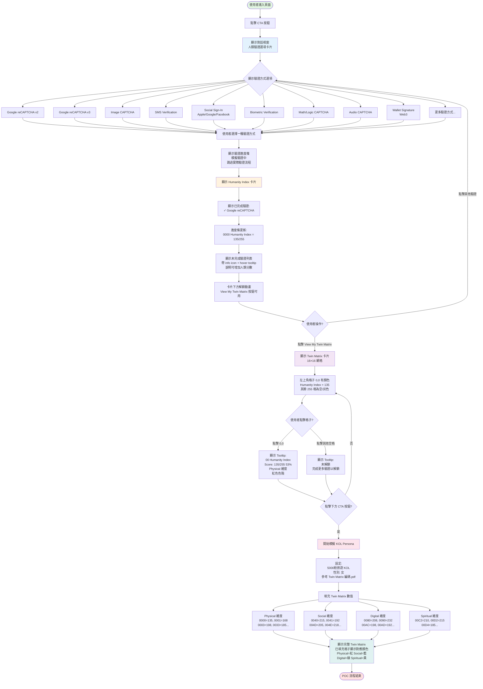

# Twin3 POC 流程圖

## 流程說明

### 階段 1: 初始驗證
1. 使用者進入頁面並點擊 CTA 按鈕
2. 顯示人類驗證選項卡片，包含 10+ 種驗證方式
3. 使用者選擇一種驗證方式（模擬驗證，跳過實際流程）

### 階段 2: Humanity Index 卡片
1. 顯示已完成的驗證（✓ Google reCAPTCHA）
2. 顯示 Humanity Index 分數（0000 = 135/255）
3. 顯示未完成驗證列表（帶 info icon 和 tooltip）
4. 解鎖 "View My Twin Matrix" 按鈕

### 階段 3: Twin Matrix 視覺化
1. 顯示 16×16 網格
2. 左上角格子 (0,0) 有顏色，代表 Humanity Index
3. 其餘 255 格為空/灰色（未解鎖）
4. 點擊格子顯示對應 tooltip

### 階段 4: KOL Persona 模擬
1. 點擊 CTA 按鈕開始模擬
2. 設定 5000 粉旅遊 KOL（女性）
3. 填充 Twin Matrix 各維度數值
4. 顯示完整 Twin Matrix，各維度用不同顏色表示

## 維度顏色對應
- **Physical**: 紅色 (#137cec)
- **Social**: 藍色 (#21c45d)
- **Digital**: 綠色 (#8a2ce2)
- **Spiritual**: 黃色 (#f08228)
